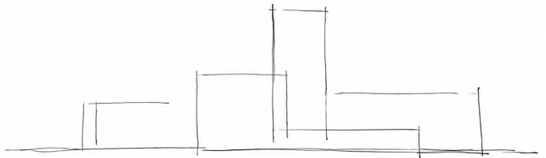
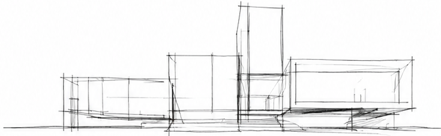
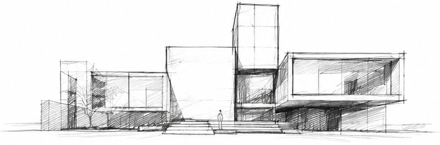
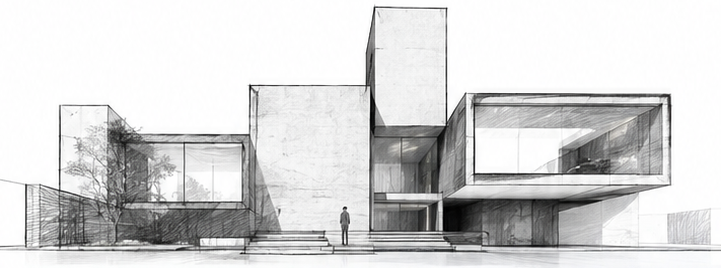
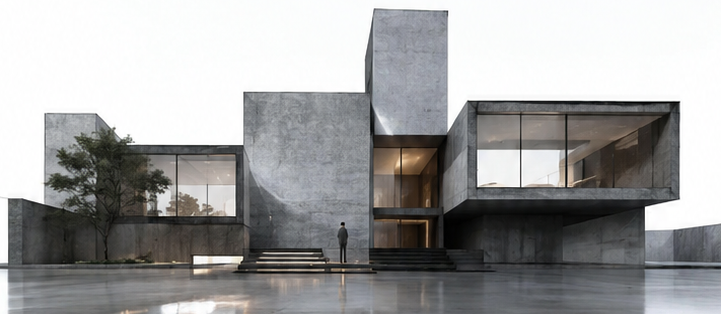

# Sayelf Space Evolution v1.0

> 变的是完成度，不变的是空间。

一个本地优先的「手绘稿 → 线 → 线稿 → 草图 → 线落成墙 → 空间生成 → 视频分镜」工作台。

## 产品定位

**标题：** 从一条线开始，让空间沿着设计意图自然生成。
**Slogan：** 变的是完成度，不变的是空间。
**内容概要：** Sayelf Space Evolution 将一张手绘稿、空间描述、空间类型与视觉风格，组织成 5 个连续的空间阶段和 1 个视频分镜 Prompt。它保留机位、透视、墙柱、门窗、楼梯与空间锚点，让空间从线条逐步走向可体验的真实场景。

## 对客户的价值

- **守住设计意图：** 用 Spatial Continuity Lock 约束连续生成，减少每一步重新设计导致的空间漂移。
- **更快完成提案：** 一次得到 5 份独立空间 Prompt 和 1 份视频 Prompt，便于快速试用、比较和交付。
- **匹配不同项目气质：** 空间类型与视觉风格可以自由组合，材质与完成度不固定为清水混凝土，可根据场景和建筑空间呈现豪华、极简、自然、商业等方向。
- **本地可控、易于协作：** 不依赖账号和付费 API，项目可保存、导出，并把 Prompt 交给客户已有的 AI 图像/视频平台继续互动。
- **更贴近客户表达：** 01 只呈现大框架与笔划过纸面，02 建立主骨架，03 保持草图风格；客户的使用场景、情绪与品牌需求转化为第一眼可感知的视角焦点。

> **材质匹配原则：** 除非客户明确指定，系统不会把清水混凝土当作默认答案；材质、光线和完成度会服从空间类型、建筑结构、视觉风格与空间描述。

## 空间描述优先的自动匹配

- 客户在「空间描述」中写出项目名称、空间类型或空间风格后，WebUI 会在本地自动识别并回填已有选项。
- 项目名称、空间类型和空间风格都可以手动修改；手动修改后，系统会保留客户选择，不再静默覆盖。
- 未识别到明确关键词时，保留当前默认项；不调用外部模型，不上传客户描述。

## 一眼看懂：从线到空间

下面是一个民宿场景的 15 秒演化示例。5 张图对应 01—05 空间阶段，结构连续，完成度逐步增加：

<table>
  <tr>
    <td align="center"><strong>01 线</strong><br></td>
    <td align="center"><strong>02 线稿</strong><br></td>
    <td align="center"><strong>03 草图</strong><br></td>
    <td align="center"><strong>04 线落成墙</strong><br></td>
    <td align="center"><strong>05 空间生成</strong><br></td>
  </tr>
  <tr>
    <td valign="top">从一笔开始，提取空间轮廓。</td>
    <td valign="top">线条叠加，建立结构层次。</td>
    <td valign="top">草图成形，明确空间关系。</td>
    <td valign="top">已有线条获得建筑厚度。</td>
    <td valign="top">按场景匹配材质、光线与生活尺度。</td>
  </tr>
</table>

这套方法适用于住宅、民宿、现代商业、展厅、体育馆、办公空间、酒店大堂、文化中心等场景；工作流不变，变化的是空间类型、风格和最终完成度。

## 自媒体画幅与横排原则

- **单张画幅：** 选择 `9:16` 或 `4:5` 时，每个阶段输出一张独立图片，单张画幅始终保持不变。
- **序列展示：** 5 张或 N 张阶段图统一高度横向排列，方便手机浏览、作品对比和自媒体传播。
- **连续性保护：** 横排只是展示编排，不把多张图拼成一张，不裁切、不拉伸，也不改变每张图的原始画幅。

## 适合谁
- 建筑/室内设计师
- AI 视觉创作者
- 自媒体空间内容创作者
- 希望把手绘构想转成连续空间演化作品的人

## 你会得到什么
- 本地 WebUI 工作台
- 手绘稿录入口
- Spatial Continuity Lock（空间一致性锁）
- 五份独立空间 Prompt + 一份视频 Prompt 生成器
- 每份 Prompt 可单独复制，支持交给任意 AI 辅助图像/视频平台
- 空间类型与空间风格可自由组合，支持现代商业、展厅、体育馆、办公空间、酒店大堂、文化中心等
- 支持现代极简、美式、法式、侘寂、简中、中式等空间风格选择
- 10/15/20 秒视频分镜 Prompt 生成器
- 项目 JSON / Markdown 导出
- 点击「保存项目」后，项目 JSON 默认写入应用目录下的 `exports/space-evolution-project.json`，界面显示实际保存路径
- 可被 AI 辅助平台读取的 Skill 文件
- Agent 执行规范、插件接口规范、示例与验收规则

## Windows 安装
1. 解压整个 ZIP 到任意文件夹。
2. 确认电脑安装 Python 3.10+。
3. 双击 `start_windows.bat`。
4. 浏览器会自动打开 `http://127.0.0.1:8765/`。

> 不需要 `pip install`，v1.0 仅使用 Python 标准库。

## macOS / Linux
```bash
chmod +x start_mac_linux.sh
./start_mac_linux.sh
```

## 最短使用流程
1. 上传手绘稿。
2. 在「预存试用场景」中选择一个场景并点击「套用场景」，或直接写自己的空间描述。
3. 直接填写空间描述；系统会自动匹配项目名称、空间类型和空间风格，也可以手动覆盖（如展厅 + 法式、体育馆 + 现代极简）。
4. 保持默认 5 项 Spatial Continuity Lock。
5. 点击「生成完整工作流」，在下方 6 张独立 Prompt 卡片中逐份复制提示词。
6. 检查 01 的大框架与划纸笔触、02 的主骨架和 03 的草图风格；客户关联的使用场景与视角冲击会写入每份 Prompt。
7. 点击「保存项目」，项目 JSON 会落到本地 `exports/space-evolution-project.json`，页面会显示实际保存路径。
8. 按 01 → 02 → 03 → 04 → 05 顺序，把空间 Prompt 和上一阶段图片交给 AI 图像平台；再把 06 视频 Prompt 交给文生视频或图生视频平台。
9. 视频阶段优先用阶段 05 成图作为首帧。

## v1.0 边界
本版本是可本地运行的空间演化工作流 Core，负责：输入、空间一致性规则、独立 Prompt/分镜编排、复制、项目保存与导出。

**它不内置第三方图像/视频模型，也不会偷偷调用任何付费 API。** 如果要一键生成图片/视频，需要用户自行接入有权限的生成 Provider；相关扩展位已经保留在 `plugins/`。

## 公开 MIT Core / 私有 Commercial Pro

本公开仓库明确定位为 **MIT Core**。根目录 `LICENSE` 适用于本公开 Core 代码与随仓库发布的 Core 文档；任何第三方文件仍以其自身许可为准。

商业 Pro 不放在本公开仓库中，而以独立私有仓库或独立商业模块交付。Pro 可以在 MIT Core 之上提供专业软件适配器、企业部署、私有模板/资产、定制集成、支持与 SLA。客户数据、私有 Provider、凭据和未公开交付材料不进入本仓库。

本仓库公开历史中的早期商业交付文件不构成当前公开 Core 的商业闭源声明；当前分支以 MIT License 和本节边界说明为准。具体商业合同应由单独的 Pro 交付材料约定。

## Space Core v0.1 开发切片

在不改变 v1.0 WebUI 用户路径的前提下，`core/space_core/` 提供平台无关的 Canonical Space Model、明确双入口、五锁状态、零插件 Native Provider 与六阶段 Prompt 资产编排。它只使用 Python 标准库；专业软件与媒体 Provider 仍是可插拔增强。

在仓库根目录运行以下命令可验证最小工程闭环：

```bash
python -m unittest discover -s tests -v
python examples/run_space_core_poc.py
```

设计决策与保留/抽取/迁移清单见 `docs/SPACE_CORE_V0_1_BUILD_DECISION.md` 和 `docs/SPACE_CORE_V0_1_INVENTORY.md`。

## 核心差异
普通工作流通常是：`Sketch → Render`。

本产品是：
`Line → Linework → Sketch → Line Becomes Wall → Space Generation → Film`

空间不是每一步重新设计，而是沿同一 Spatial DNA 连续生长。

## 文件说明
- `webui/`：本地交互工作台
- `skill/`：可供 AI 辅助平台读取的专业 Skill
- `agent/`：自动执行层规范
- `core/`：Spatial DNA 与连续性规则
- `plugins/`：AI 平台与生成 Provider 插件接口
- `interfaces/`：MCP / CLI / API 方向说明
- `examples/`：演示案例
- `docs/`：安装、销售交付、故障排查
- `tests/`：验收规则

## 许可与商业边界

公开 Core 按 MIT License 发布。商业 Pro、客户交付、专业 Provider 和私有资产不包含在本公开仓库中，也不由本仓库的 MIT Core 声明替代其单独的商业条款。
